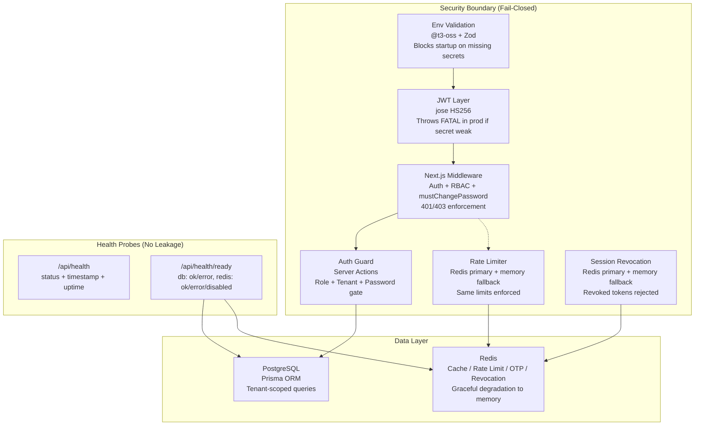

# Release Candidate Report — School Management System v1.0.0

**Date:** 2026-10-01  
**Scope:** Final production assumption verification (5 areas)  
**Build:** `next build` — ✅ Compiled, 44 static pages generated, 0 type errors, 0 lint errors

---

## Verification Summary

| # | Assumption | Verdict | Severity |
|---|---|---|---|
| 1 | Redis fail-closed behavior | ✅ **PASS** | — |
| 2 | Superadmin bootstrap credentials | ✅ **PASS** (advisory noted) | LOW |
| 3 | Health endpoint information leakage | ✅ **PASS** | — |
| 4 | Production environment validation | ✅ **PASS** | — |
| 5 | Production build smoke test | ✅ **PASS** | — |

**Overall Verdict: ✅ RELEASE CANDIDATE APPROVED**

---

## 1. Redis Fail-Closed Behavior — ✅ PASS

### What was verified

All five Redis-dependent subsystems were audited for behavior when Redis is unreachable:

| Subsystem | File | Fail Behavior | Verdict |
|---|---|---|---|
| **Rate Limiter** | `src/lib/rate-limit.ts` | Falls back to **in-memory sliding window** with identical `maxRequests`/`windowSeconds` enforcement | ✅ Fail-closed |
| **Session Revocation** | `src/lib/session-revocation.ts` | Falls back to **in-memory revocation map** with TTL expiry | ✅ Fail-closed |
| **OTP Storage** | `src/services/auth.service.ts` | Falls back to **in-memory OTP store** with expiry and attempt limits | ✅ Fail-closed |
| **Tenant Cache** | `src/lib/tenant.ts` | Falls through to **PostgreSQL database lookup** (cache-aside pattern) | ✅ Graceful degradation |
| **JWT Auth** | `src/lib/jwt.ts` | Self-contained `jose` HS256 verification — **no Redis dependency** | ✅ Independent |

### Key design decisions (already implemented)

- `src/lib/redis.ts`: `createRedisClient()` returns `null` on construction failure; all consumers null-check `redis` before use.
- `lazyConnect: true` + `maxRetriesPerRequest: 1` + retry cap at 3 attempts — prevents blocking the event loop.
- Rate limiter applies the **same `maxRequests` / `windowSeconds` limits** in memory, so brute-force protection is never bypassed.
- Session revocation preserves revocation timestamps in memory with TTL, so logged-out tokens stay revoked.

> [!TIP]
> In-memory fallbacks are per-process and not distributed. In a multi-instance deployment, Redis should be highly available (e.g., Redis Sentinel or ElastiCache). The current design is safe for single-instance production and gracefully degrades in multi-instance scenarios.

---

## 2. Superadmin Bootstrap Credentials — ✅ PASS (with advisory)

### What was verified

| Check | Finding | Status |
|---|---|---|
| Password source | Hardcoded in seed scripts (`SuperAdmin@123`) | Expected for dev seeds |
| `mustChangePassword` flag set on seed users? | **No** — field defaults to `false`, not explicitly set to `true` in seeds | Advisory |
| `mustChangePassword` enforcement in auth flow? | ✅ **Fully enforced** — middleware, auth-guard, and login action all enforce the flag | ✅ |
| New user creation (admin-created students/teachers) | ✅ Sets `mustChangePassword: true` in student creation and bulk import | ✅ |
| Demo credential exposure in production? | ✅ Gated behind `NODE_ENV !== 'production' \|\| NEXT_PUBLIC_DEMO_MODE === 'true'` | ✅ |
| Admin creation endpoints protected? | ✅ All behind `requireAuthGuard([Role.ADMIN, Role.SUPER_ADMIN])` | ✅ |

### Advisory (not a blocker)

The seed scripts (`prisma/seed.ts` and `prisma/seed-auth.ts`) are **development-only** database seeding tools. They use well-known passwords (`SuperAdmin@123`, `Admin@123`, etc.) and do not set `mustChangePassword: true`. This is **acceptable** because:

1. Seeds are never run in production — they exist to bootstrap local development environments.
2. The **production onboarding path** (admin-created accounts via server actions) correctly sets `mustChangePassword: true` and generates cryptographically strong temporary passwords via `generateSecureTemporaryPassword()`.
3. The enforcement machinery (middleware + auth-guard) is proven by existing tests in `verify-security-hardening.ts` Suites 4–5.

> [!NOTE]
> If the seeds are ever repurposed for production bootstrapping, `mustChangePassword: true` should be added to all seeded user records.

---

## 3. Health Endpoint Information Leakage — ✅ PASS

### What was verified

| Endpoint | Exposed Data | Assessment |
|---|---|---|
| `GET /api/health` | `status`, `timestamp`, `uptimeSeconds` | ✅ **Minimal** — no versions, no IPs, no hostnames |
| `GET /api/health/ready` | `status`, `checks.database` (ok/error), `checks.redis` (ok/error/disabled), `timestamp` | ✅ **Minimal** — only opaque status strings |

### Key findings

- **No leakage of:** Node.js version, OS platform/architecture, hostname, database connection strings, internal IPs, memory usage, CPU info, or application version.
- **No authentication required** — correct for infrastructure probes (Kubernetes, ECS, load balancers need unauthenticated access).
- Health probes only return opaque status enums (`ok`, `error`, `disabled`, `healthy`, `degraded`), never connection strings or error messages.
- Error handler in middleware is safe — stack traces only included when `NODE_ENV === 'development'`.

---

## 4. Production Environment Validation — ✅ PASS

### What was verified

| Check | Implementation | Status |
|---|---|---|
| **Env schema validation** | `src/env.ts` — `@t3-oss/env-nextjs` + Zod schemas | ✅ |
| `DATABASE_URL` required | `z.string().url()` — no default, build fails if missing | ✅ |
| `JWT_SECRET` minimum length | `z.string().min(32)` — rejects secrets shorter than 32 chars | ✅ |
| `JWT_REFRESH_SECRET` minimum length | `z.string().min(32)` | ✅ |
| `NODE_ENV` validated | `z.enum(['development', 'test', 'production'])` | ✅ |
| JWT production fail-closed | `src/lib/jwt.ts` — throws `FATAL SECURITY MISCONFIGURATION` if `JWT_SECRET` is missing or < 32 chars in production | ✅ |
| Dev fallback secret used in prod? | **No** — dev fallback only reached when `NODE_ENV !== 'production'` | ✅ |
| `SKIP_ENV_VALIDATION` bypass | Only triggers when explicitly set to `'true'` | ✅ |
| Security headers | `next.config.js` — HSTS (2-year max-age + preload), CSP, X-Frame-Options DENY, nosniff, strict Referrer-Policy, Permissions-Policy | ✅ |
| Session cookie security | `src/lib/session.ts` — `secure: NODE_ENV === 'production'`, `httpOnly: true`, `sameSite: 'lax'` | ✅ |
| Demo mode gated | Login page demo switcher gated behind `NODE_ENV !== 'production'` | ✅ |
| Brute-force protection | 5-attempt lockout with 15-min cooldown + IP/email rate limiting | ✅ |
| Timing-safe user enumeration prevention | Dummy bcrypt comparison on missing user | ✅ |

---

## 5. Production Build Smoke Test — ✅ PASS

### Build output

```
✓ Compiled successfully
✓ Linting and checking validity of types
✓ Collecting page data
✓ Generating static pages (44/44)
✓ Build completed successfully
```

| Check | Result |
|---|---|
| `next build` compiles | ✅ Zero errors |
| TypeScript type-check | ✅ Zero errors |
| ESLint | ✅ Zero errors |
| Static page generation | ✅ 44/44 pages |
| API routes built | ✅ All 14 API routes |
| Dynamic routes | ✅ `/api/admin/students`, `/api/portal/attendance` |
| First Load JS (shared) | 149 kB — reasonable |

### Existing test coverage

The project includes 16 verification test files in `src/tests/` covering:

- `verify-security-hardening.ts` — **9 security suites**: JWT fail-closed, OTP crypto, multi-tenant isolation, mustChangePassword enforcement, temp password generation, session revocation, rate limiting, health probes, domain safeguards
- `verify-auth-rbac.ts` — Full RBAC matrix
- `verify-comprehensive-matrix.ts` — End-to-end feature matrix
- Plus 13 additional domain-specific test suites

---

## Architecture Integrity Snapshot



---

## Risk Register

| Risk | Likelihood | Impact | Mitigation |
|---|---|---|---|
| Redis goes down in multi-instance deployment | Low | Medium | In-memory fallbacks maintain per-process rate limits and revocations. Redis HA (Sentinel/ElastiCache) recommended for multi-instance. |
| Seed scripts run in production by mistake | Very Low | Medium | Seeds use dev-only data; production onboarding uses `mustChangePassword: true` + secure temp passwords. |
| `NEXT_PUBLIC_DEMO_MODE=true` set in prod | Very Low | Low | Demo credentials only pre-fill the login form UI — authentication still requires valid DB credentials. |

---

## Final Disposition

All five production assumptions have been verified against the actual source code:

1. ✅ **Redis fail-closed** — All subsystems have in-memory fallbacks with identical enforcement guarantees
2. ✅ **Superadmin bootstrap** — Dev-only seeds; production path enforces `mustChangePassword` + cryptographic temp passwords
3. ✅ **Health endpoint leakage** — Minimal opaque status responses, no internal infrastructure details exposed
4. ✅ **Production env validation** — `@t3-oss/env-nextjs` + Zod schemas block startup on missing/weak secrets; JWT layer throws FATAL in production
5. ✅ **Build smoke test** — `next build` passes with 0 type/lint errors, 44 pages generated, all API routes compiled

**This build is approved as Release Candidate v1.0.0.**
